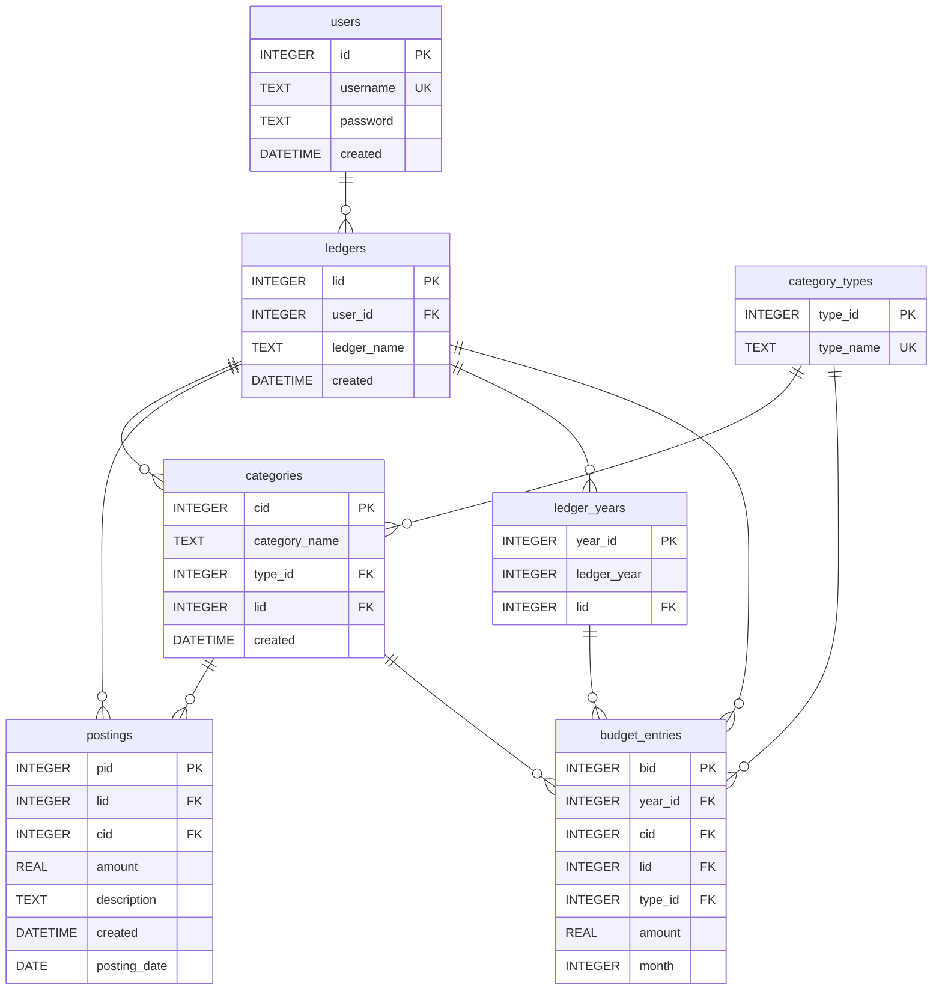

# ER Diagram

```mermaid
erDiagram
    users {
        INTEGER id PK
        TEXT username UK
        TEXT password
        DATETIME created
    }

    ledgers {
        INTEGER lid PK
        INTEGER user_id FK
        TEXT ledger_name
        DATETIME created
    }

    category_types {
        INTEGER type_id PK
        TEXT type_name UK
    }

    categories {
        INTEGER cid PK
        TEXT category_name
        INTEGER type_id FK
        INTEGER lid FK
        DATETIME created
    }

    postings {
        INTEGER pid PK
        INTEGER lid FK
        INTEGER cid FK
        REAL amount
        TEXT description
        DATETIME created
        DATE posting_date
    }

    ledger_years {
        INTEGER year_id PK
        INTEGER ledger_year
        INTEGER lid FK
    }

    budget_entries {
        INTEGER bid PK
        INTEGER year_id FK
        INTEGER cid FK
        INTEGER lid FK
        INTEGER type_id FK
        REAL amount
        INTEGER month
    }

    users ||--o{ ledgers : ""
    ledgers ||--o{ categories : ""
    ledgers ||--o{ postings : ""
    ledgers ||--o{ ledger_years : ""
    ledgers ||--o{ budget_entries : ""
    category_types ||--o{ categories : ""
    category_types ||--o{ budget_entries : ""
    categories ||--o{ postings : ""
    categories ||--o{ budget_entries : ""
    ledger_years ||--o{ budget_entries : ""
```
