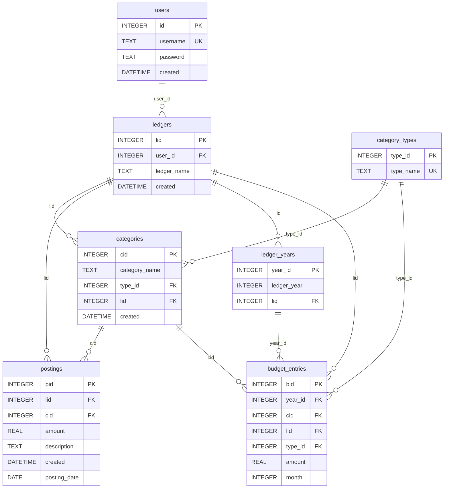

# ER Diagram using mermaid (https://github.com/mermaid-js/mermaid)

## Legend
PK = Primary Key
FK = Foreign Key
UK = Unique Key
Lines = relationships, all of relationsship type one to many. A straight end closest to the parent entity indicates an 'exactly one' relationsship. The forked end with a circle closest to the child entity indicates a 'zero or many' relationsship.
